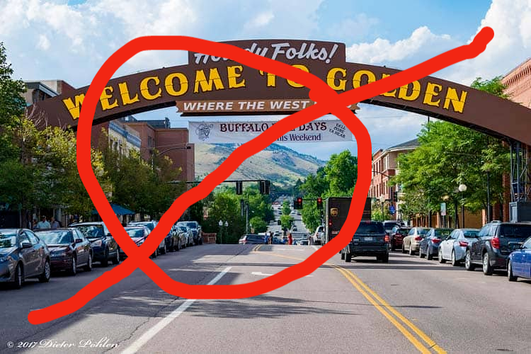

# Nothing Golden Can Stay

## League
[Week # Avail Poll](.)

**Fri 8p Eastern**

**Lineup**: Laura John David Grant

On deck: Andy?

Opponent: 2 Fast 2 Curious

### Dues for last season
$1.7 per game played

## Friendlies we're playing
TBD

## Friendly We're Writing
Scheduled for Week 11 of the Summer '22 season and DUE JULY 24

[Questions We're writing](https://docs.google.com/spreadsheets/d/1rjFAIZp3KI-GkO0D_L4ANVb0S6nezp9QoC5S6Etj3uI/edit?usp=sharing)

[Friendly Guidance](https://docs.google.com/document/d/1m6y50y3U98cBSoXEoGXT4Nwt-_kcQupFMNcIKZVnaCs/mobilebasic?fbclid=IwAR2mKISWy2Ja-hbksq6ksOHCwuWZ_pWJ4tpWdsTcc7yevKJolvqdoBkRmGg)

## Other Annoucements/Links

- [**PRIVATE PROTOBOWL ROOM**](https://protobowl.com/nothing-golden-can-stay)

- [**MIMIR'S WELL**](https://www.mimirswell.co.uk/), an international solo online quiz (same format as Pop Solos) begins June 4th. 

- [ **WORLD QUIZZING CHAMPIONSHIPS**](http://www.worldquizzing.com/) are online/in person on June 4th! Venues confirmed in Boulder CO, Washington DC, Chicago
